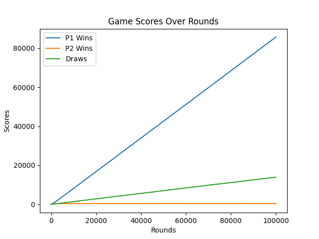
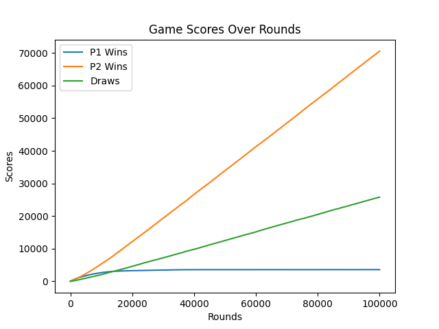
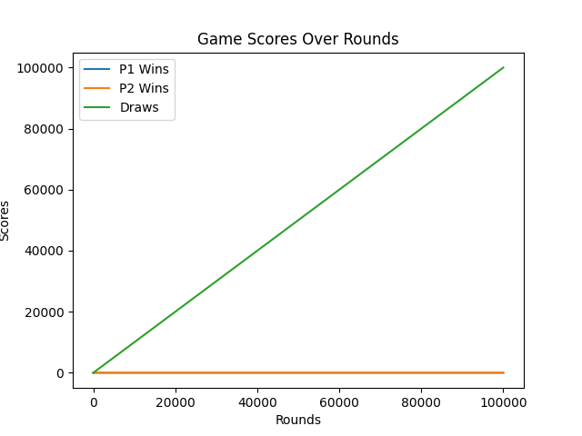

# 5TAV (Disciplina de ADS (FAETERJ-RIO)) <!-- omit in toc -->

- [Jogo da Velha Inteligente](#jogo-da-velha-inteligente)
  - [Análise de Desempenho dos Jogadores Aleatório e Campeão](#análise-de-desempenho-dos-jogadores-aleatório-e-campeão)
  - [Relatório do Jogador Inteligente](#relatório-do-jogador-inteligente)
    - [Funcionamento](#funcionamento)
    - [Análise de Desempenho do Jogador Inteligente](#análise-de-desempenho-do-jogador-inteligente)

## Jogo da Velha Inteligente

- Todos os testes foram feitos com 100.000 amostras.

### Análise de Desempenho dos Jogadores Aleatório e Campeão

- **Aleatório x Aleatório**:
  - Vitórias Aleatório 1: 58.69%
  - Vitórias Aleatório 2: 28.77%
  - Empates: 12.53%

- **Aleatório x Campeão**:
  - Vitórias Aleatório: 0%
  - Vitórias Campeão: 86.36%
  - Empates: 13.64%

- **Campeão x Aleatório**:
  - Vitórias Campeão: 97.79%
  - Vitórias Aleatório: 0%
  - Empates: 2.21%

- **Campeão x Campeão**:
  - Vitórias Campeão 1: 0%
  - Vitórias Campeão 2: 0%
  - Empates: 100%

### Relatório do Jogador Inteligente

#### Funcionamento

Durante a vez do jogador inteligente, inicialmente verifica-se se ele venceu, empatou ou perdeu a partida. Em caso de vitória, as jogadas aleatórias realizadas são salvas no array `moves_database[]`, com uma pontuação atribuída a elas. As jogadas utilizadas diretamente do `moves_database[]` recebem uma recompensa, como um incremento de +1 na pontuação do respectivo sub-array contido no `moves_database[]`. Em caso de derrota, as jogadas utilizadas diretamente do `moves_database[]` recebem uma punição, como um decremento de -2. Se a pontuação ficar menor que zero, o sub-array correspondente é removido do `moves_database[]`. Em caso de empate, aplica-se uma punição às jogadas do `moves_database[]`, com um decremento de -1. Após isso, os sub-arrays (jogadas) do `moves_database[]` são organizados (sort) em ordem decrescente de pontuação.

Se a partida ainda estiver em andamento, o jogador inteligente itera pelo `moves_database[]` procurando a primeira jogada aplicável ao estado atual do tabuleiro. Se encontrar, essa jogada é realizada e salva em um array temporário, para posterior recompensa ou punição.

Caso não encontre uma jogada aplicável, realiza-se uma jogada aleatória, que é salva em um array temporário, para posterior inclusão no `moves_database[]` caso o jogador inteligente vença essa rodada.

Ajustando o sistema de recompensas e punições, os valores ideais encontrados foram (+1 vitória), (-10 derrota) e (-1 empate), para que o jogador adversário vença menos. No entanto, acredito que essa configuração possa resultar em mais empates. Esses valores não foram modificados extensivamente, ficando a critério do usuário do código encontrar valores mais adequados.

#### Análise de Desempenho do Jogador Inteligente

- **Inteligente x Aleatório**:
  - Vitórias Inteligente: 85.67%
  - Vitórias Aleatório: 0.42%
  - Empates: 13.91%

  

- **Aleatório x Inteligente**:
  - Vitórias Aleatório: 3.58%
  - Vitórias Inteligente: 70.61%
  - Empates: 25.81%

  

- **Inteligente x Campeão**:
  - Vitórias Inteligente: 0%
  - Vitórias Campeão: 0%
  - Empates: 100%

- **Campeão x Inteligente**:
  - Vitórias Campeão: 0.02%
  - Vitórias Inteligente: 0%
  - Empates: 99.98%

- **Inteligente x Inteligente**:
  - Vitórias Inteligente 1: 0.01%
  - Vitórias Inteligente 2: 0%
  - Empates: 99.99%

  
